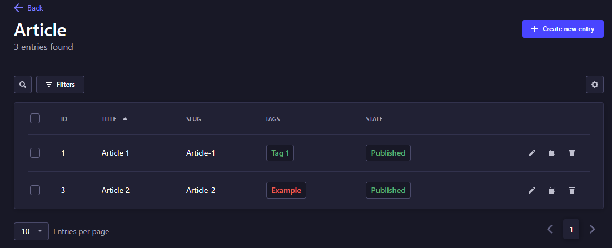
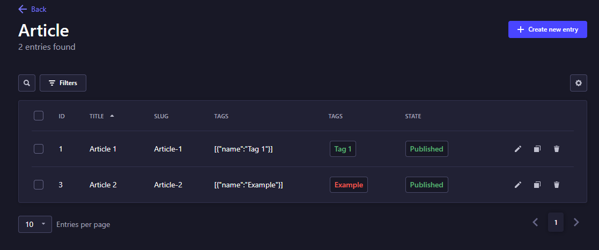
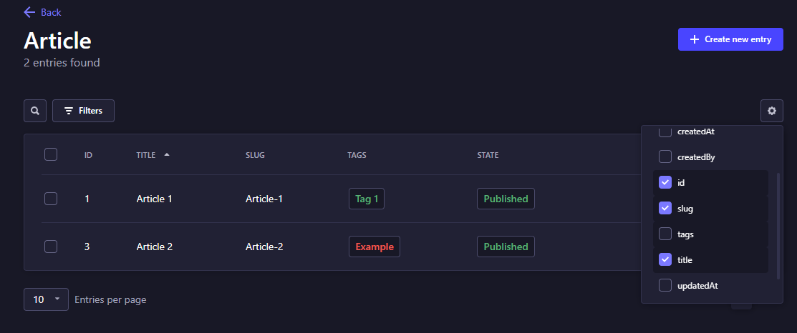

# Strapi Plugin Smart Tags

A Strapi plugin that allows you to add custom tags to your content which can be viewed in the main table for that content type. The records can then be filtered based on the selected tag.

## ⚙️ Installation

### Using npm
```
npm install strapi-plugin-smart-tags
```

### Using yarn
```
yarn add strapi-plugin-smart-tags
```

---

## ❔Usage

### Editing your schema to include Smart Tags
To allow tags on a collection type, edit `./src/api/[content-type-name]/content-types/[content-type-name]/schema.json` using the following structure

```
{
  "pluginOptions": {
    "smart-tags": {
      "fieldName": "Tags",
      "tags": {
        "None": { "color": "neutral" },
        "Green": { "color": "success" },
        "Red": { "color": "danger" },
        "Amber": {"color": "warning" },
        "Primary": { "color": "primary" },
        "Secondary": { "color": "secondary" },
        "Alternative": {"color": "alternative"}
      },
      "defaultTag": "None"
    }
  },

  ...

  "attributes": {
    ...
    "Tags": {
      "type": "customField",
      "options": {
        "apiUrl": link to an api that returns pre defined tags
      },
      "customField": "plugin::smart-tags.smart-tags"
    }
    ...
  }
}
```
- The `pluginOption` section lets you configure any pre-made tags for the collection type, and also allows you specify a colour for each of these.

- `fieldName` must reference the field you specify in the `attributes` section.

- `defaultTag`: this colour will be assigned to all tegs by default if the tag is not pre-made with an assigned colour.

### Using Smart Tags in the Strapi portal



- The Smart Tags Plugin allows you to view the tags in a permanent column and your content-type records can be filtered on these tags. There is a small limitation regarding the filtering which is listed in the section below.

---

## 📑 Current Limitations / ToDo



- The Tags column appears by default as a column containing JSON which is what Strapi will use when you attempt to filter based on the tag. This means the entire element within this column e.g. `[{"name":"Tag 1"}]` is included in the filter, so Strapi will filter including any string that is within this element (e.g 'name', 'me').



- The two Tags columns show up by default but this can be changed by clicking the settings button and deselecting *tags*.

---